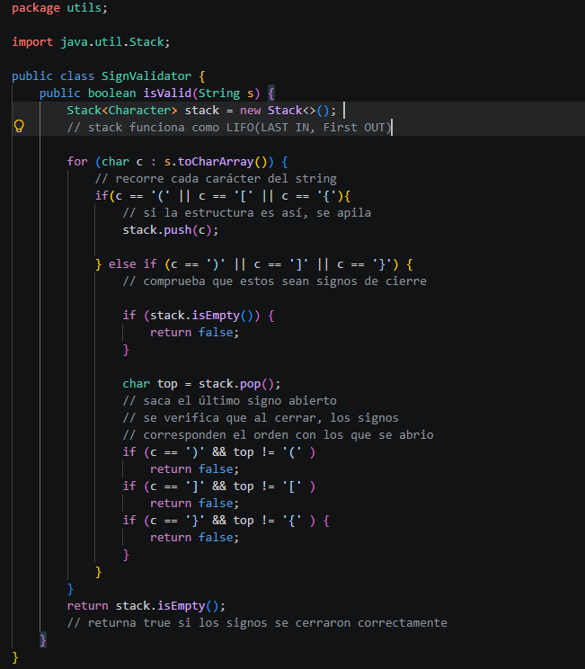
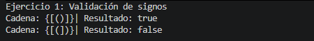
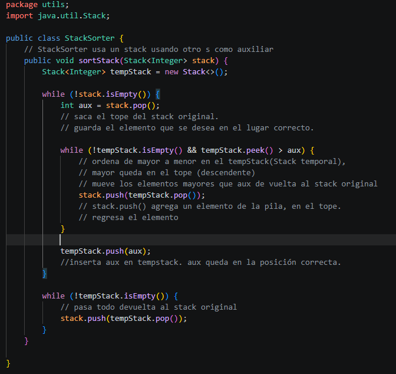
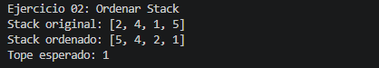
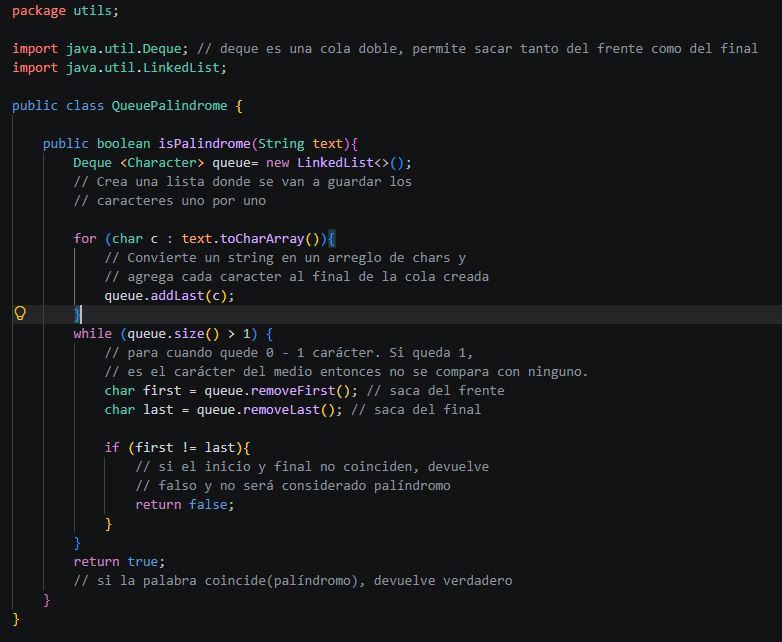
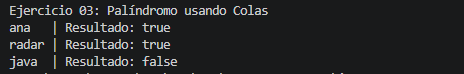

# Práctica: [Ejercicios de lógica con Estructuras lineales: pilas y colas]

## Datos del Estudiante:
- **Nombre:** [Nataly Jiménez Salazar]
- **Curso:** [Grupo- 3 - Computación]
- **Fecha:** [2026-06-10]

---
## Descripción del proyecto: 
- En este proyecto se trabajó en código usando las **estructuras dinámicas lineales** como pilas ``(LIFO: Last IN, First Out)`` y colas ``(FIFO: First IN, First OUT)``, realizando tres ejercicios en total: validación de signos, ordenamiento de stack y verificando que las palabras ingresadas son palíndromas. Estos métodos permiten comprender como actúa o comporta cada estructura y su aplicación en la resolución de problemas con algorítmos.
---
## 1. [Ejercicio #1: Validación de Signos]

**Descripción del Ejercicio:** En este ejercicio se implementó el método ``isValid``con un ``(String s)`` usando una pila ``(FIFO)`` para verificar si los signos ingresados están correctamente cerrados o balanceados. Se probaron dos cadenas ``{[(`` y ``)]}`` y retornó ``true`` debido a que cumplió con la condición del if, en caso de no cumplirla devolvió ``false``.

***Descripción:** Bloque de código  - ``Ejercicio #1: Validación de Signos``*

***Descripción:** Salida de consola - ``Ejercicio #1: Validación de Signos``*

---

## 2. [Ejercicio #2: Ordenar Stack]
**Descripción del Ejercicio:** Se implementó ``sortStackStack(<Integer> stack)``, usando un ``stack`` auxiliar temporal para ordenar números de forma descendente, el stack que se ingresó originalmente era [2, 4, 1, 5] y devolvió [5, 4, 2,1], teniendo un tope esperado de 1.

***Descripción:** Bloque de código  - ``Ejercicio #2: Ordenar Stack``*

***Descripción:** Salida de consola - ``Ejercicio #2: Ordenar Stack``*

---

## 3. [Ejercicio #3: Palíndromo usando Colas]
**Descripción del Ejercicio:** Se emplementó el método ``isPalindrome(String text)`` usando ``Deque`` para aprovechar el comportamiento de la estructura ``FIFO``, comparando caracteres desde ambos extremos (frente y final), hacia el centro. Ingresamos las palabras ``ana``, ``radar`` y ``java``, las dos primeras, regresaron ``true`` y por lo tanto son palíndromas, mientras que con la palabra java, retornó ``false``, siendo una palabra considerada no palíndroma.

***Descripción:** Bloque de código  - ``Ejercicio #3: Palíndromo usando Colas``*

***Descripción:** Salida de consola - ``Ejercicio #3: Palíndromo usando Colas``*

---
## Conclusiones:
- **Pilas:** Las Pilas o Stacks operan bajo el principio ``LIFO(Last IN, First OUT)`` y cuenta con operaciones como ``stack.push()`` que agrega un elemento al tope de la pila, ``stack.peek()`` que observa el dato sin eliminarlo y, ``stack.pop()`` que obtiene el último dato ingresado y lo elimina. Utilizado en el ``Ejercicio 01 - Validación de Signos``.
- **Colas:** Las Colas o Queue operan bajo el principio de ``FIFO(First IN, First OUT)``, donde el primer elemento en entrar es el primero en salir como por ejemplo: en una fila que se forma en el cajero, el primero en formarse, será el primero en ser atentido y salir. Usamos ``Deque`` para que se pueda acceder tanto desde el final como desde el principio, lo que permite comparar los extremos, así como se hizo en el ``Ejercicio 03 - Cola Palindroma``.
- Elegir la estructura lineal dinámica correcta depende del problema que se tenga que resolver, una pila es idaul para el orden inverso de los elementos, mientras que una cola es adecuada para controlar el orden de llegada o comparar extremos al mismo tiempo.